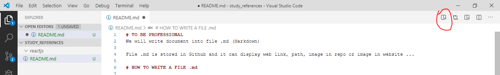

# TO BE PROFESSIONAL
We will write document into file .md (Markdown)

File .md is stored in Github and it can display web link, path, image in repo or image in website ...

# HOW TO WRITE A FILE .md

1. We will use visual code to edit file .md
    - Open visual code > ctr+shift+x > search Mardown Preview Ehanced > install
    -  Affter installing > open file .md on visual code to edit
    - To show how the file displays on github > click on button marked like below image
    
         It will look like this
    
2. Syntax of file Markdown
    - This is the guide of  [Markdown Syntax](https://github.com/adam-p/markdown-here/wiki/Markdown-Cheatsheet)
    - Focus on: heading, add code, link and image
    - This README.md is also an example to

[BẤM VÔ LINK NÀY NÈ](test_images/test_img.jpg)
